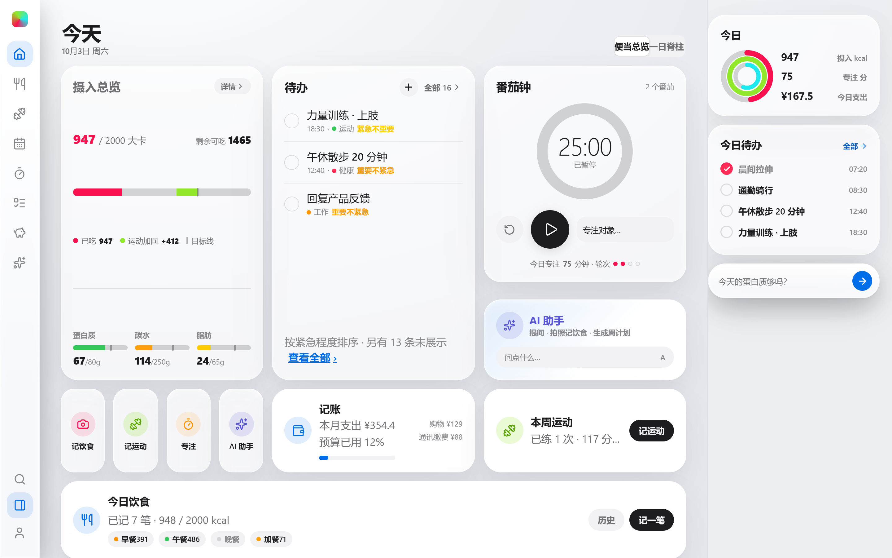
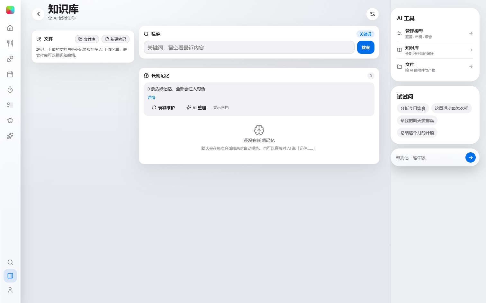
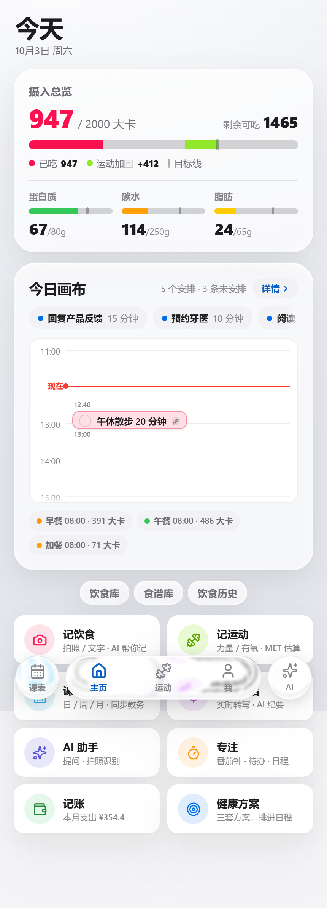
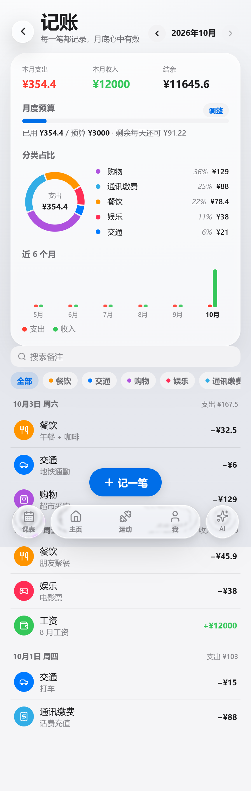
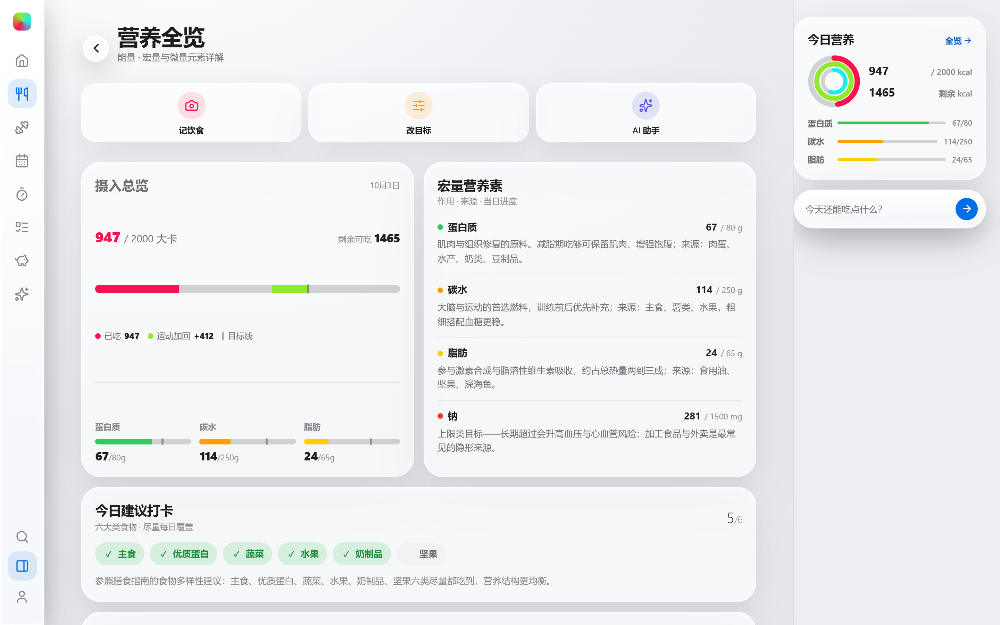
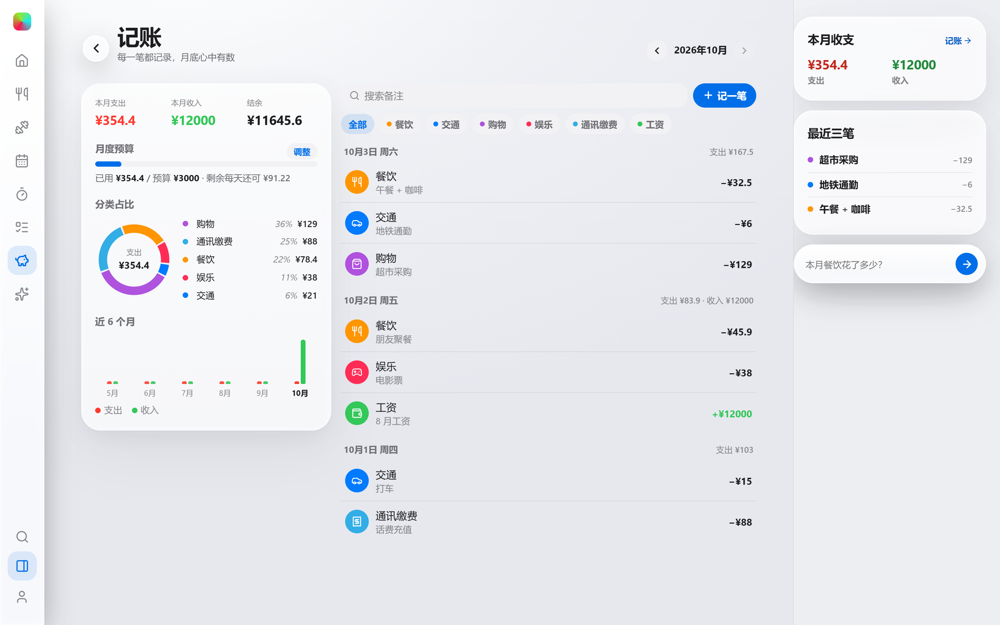

# Rein · 全能生活助理

一个**以 AI 为中枢**的个人生活助理：饮食、营养、运动、待办、专注、记账、课表、知识库，
长在同一条时间线上，并且**都能被 AI 读懂、也能被 AI 操作**。

Tauri 2 + Vue 3 + Rust（SQLite），单机优先、数据留在本地；Windows 与 Android 同一份代码。
观感对齐 Apple 的 Liquid Glass —— 四档画质可选，最高档（极致）把折射与多层光学铺到内容层。



## 为什么叫「助理」而不是「工具箱」

同类应用通常是若干互不相干的模块拼在一起：记饮食的不知道你今天练了什么，记账的不知道你明天几点有课。
Rein 的差别在于**它们共享同一份数据与同一条时间线**，而 AI 是那个把数据串起来的人：

- **它读得到**：今日饮食、本周运动与肌群练够分、今天的待办、这个月的开销、明天的课表、你的知识库笔记。
  （首页右侧的「试试问」就是这套能力的入口：*分析今日饮食* / *这周运动量怎么样* / *帮我把明天安排满* / *总结这个月的开销*。）
- **它能动手**：对话里直接调用工具去写数据 —— 拍照或一句话记一餐、记一笔账、把某事排进明天的日程。
- **它会沉淀**：回答不是一个消失的气泡，而是可留存的**卡片**与**文件**；知识库里的笔记会长期记住你。

## AI 系统

| 能力 | 说明 | 入口 |
| --- | --- | --- |
| 自带模型 | 接入你自己的模型服务，多套配置随时切换 | 设置 › AI › 管理模型 |
| 对话即操作 | 工具调用：记饮食 / 记一笔账 / 排日程 / 查运动 / 读课表 | AI 页对话 |
| 卡片式产物 | 回答以卡片落到画布上，可回看、可再问 | AI 页（AiBoard） |
| 知识库 | 笔记 / 文件 / 文件夹 + **本地 embedding 向量检索** | AI › 知识库 |
| 长期记忆 | 会话里自动提取要点并注入后续对话 | AI › 知识库 › 长期记忆 |
| 虚拟文件 | AI 的附件与产物都是文件，可浏览、可引用 | AI › 文件 |
| 语音对话 | 实时转写，结束时自动整理成纪要 | 主页「语音对话」 |



## 多平台适配

**同一份代码同时跑在手机与电脑上**，靠视口宽度切换两副形态，而不是两套工程：

- **电脑端**（视口 ≥ 1100px）：切成三窗格工作台 —— 导航轨 + 主人区 + 右侧信息栏，
  `Ctrl+K`（macOS `⌘K`）唤起命令面板直达任意页面；主人区首页还可在「便当总览 / 一日脊柱」之间切换。
- **手机端**（430×932，也是桌面窗口的出厂尺寸）：底部页签 + 单列卡片流，
  下拉回弹、手势跟随、抽屉式半模态；桌面端能做的操作手机端一样不少。
- 视口介于两者之间（平板 / 窄窗口）时退回单列，但保留全部功能，不做阉割版。

| 手机端 · 今天 | 手机端 · 记账 |
| --- | --- |
|  |  |

| 电脑端 · 营养全览 | 电脑端 · 记账 |
| --- | --- |
|  |  |

## 快速开始

```bash
npm install          # 前端依赖
npm run app:dev      # 桌面端开发（自动起 vite + rust，窗口 430×932）
npm run app:build    # 打包 NSIS 安装包
```

纯浏览器 UI 开发（无后端，走内存 mock 与演示数据）：

```bash
npm run dev          # http://localhost:1420
```

其他常用命令：`npm run typecheck`（类型检查）、`npm run build`（类型检查 + 前端构建）、
`npm run contract`（IPC 契约三处一致性校验）、`npm run lint`、`npm run icon`（重新生成图标）。

## 功能地图

| 功能 | 能做什么 | 前端入口 | 后端模块 |
| --- | --- | --- | --- |
| AI 对话与工具 | 问答、工具调用、卡片产物、历史与文件 | AI 页 | `modules/ai` |
| 知识库 | 笔记/文件索引、向量检索、长期记忆 | AI › 知识库 | `modules/kb` |
| 记饮食 | 拍照 AI / 文字 AI / 食物库三种植入方式 | 主页快捷入口、AI 页 | `modules/diet` + `modules/ai` |
| 能量与营养 | 目标 / 摄入 / 运动消耗，三大宏量 + 钠与微量元素 | 主页首卡、饮食全览 | `modules/nutrition` |
| 食谱库 | 模板浏览、喜欢不喜欢、按目标生成一日菜单 | 主页「食谱库」 | 偏好存 `recipe_prefs`，生成在前端 `ai/recipeGen.ts` |
| 待办与时间线 | 日时间线 / 周视图 / 月视图，紧急重要四象限 | 主页待办卡、全部待办 | `modules/todo` |
| 番茄钟 | 关联待办、会话存档、今日轮次 | 主页番茄钟卡 | `modules/pomodoro` |
| 运动 | 有氧与日常活动，MET 估算消耗并计入能量平衡 | 运动页 | `modules/exercise` |
| 力量训练 | 课程模板 → 做组 / 组间休息 / 计时动作 → 汇总；练够分与肌群热力图 | 运动页「今日训练」 | 状态机 `stores/session.ts`，落库 `modules/session` + `modules/tracking` |
| 动作库与重量曲线 | 动作的唯一真源，重量曲线按此聚合 | 运动 › 动作库 | `modules/exercise_lib` |
| 健康方案 | 程序算三档基线 → 日程级展开 → AI 复盘调参 | 我 › 健康方案 | `modules/program` |
| 课表与教务 | 绑定教务系统同步课表并写进时间线；课程详情、培养方案、选课与抢课；官方调休映射 | 主页课表卡 | `modules/campus` |
| 记账 | 分类记账、月度预算、分类占比、近六个月趋势 | 主页记账卡 | `modules/ledger` |
| 录音 | 录音台、未归档 take 管理、附加到待办 | 我 › 录音 | `modules/voice` |
| 多设备同步 | 同网段直连 / 跨网段打洞 / 中转，三条路都是端到端加密 | 设置 › 多设备同步 | `modules/sync` + `server/` |
| 软件更新 | 多源清单、Ed25519 双验签、断点续传、应用内安装 | 设置 › 关于 › 软件更新 | `modules/update` + `server/` + `scripts/release/` |

## 画质与动效

四档固定画质（设置 › 性能），手动钉死不自动切：

| 档位 | 做了什么 |
| --- | --- |
| 流畅 | 玻璃顶成实底、关模糊与循环动画，合成成本最低 |
| 高画质 | 玻璃材质铺到卡片 / 抽屉 / 菜单 / 操作面板与页头圆钮（不含折射） |
| 超高 | 在其上加折射（塌缩管线）与两道光学层 |
| 极致 | 与超高同一条折射管线，光学层更深一档、外缘层加厚 |

动效可单独关 / 默认 / 丰富：关掉不做任何补间，丰富档再加液态融合、定向光晕与抽屉透镜式进出。
掉帧降级时丰富档会自动退回默认。

## 平台与发布

打 tag 触发 GitHub Actions：并行构建 Windows NSIS 与 Android APK，再统一签名、组装更新清单，
发到 GitHub Release 与 Rein 在线服务。安装包在下载与安装前各做一次验签。

```bash
git tag v0.5.3 && git push rein v0.5.3
```

本地发布（与服务端 / 更新签名相关）见 [docs/UPDATES.md](docs/UPDATES.md)。

## 目录结构

```
├─ docs/                    # 架构与规范文档（先读这两个再动手）
├─ resources/foods.json               # 食物库种子（前端 mock 与 Rust 共用）
├─ resources/workout_plans.json       # 内置课程种子（含器械 meta）
├─ resources/recipe_templates.json    # 食谱模板库（脚本从 foods.json 实算生成）
├─ scripts/                 # 工具脚本 + IPC 契约校验
│  └─ release/              # 更新发布工具链（keygen / publish / verify / e2e / deploy）
├─ server/                  # Rein 在线服务（零依赖 Node：更新分发 + 预留模型网关）
├─ src/                     # Vue 前端
│  ├─ components/           # 按领域分目录：ai / campus / diet / nutrition / todo /
│  │                        #   exercise / program / ledger / voice / workbench / layout / common
│  ├─ pages/                # 页面（四个一级页 + 各自二级/三级内容页）
│  ├─ stores/               # Pinia 状态（按领域一店）
│  ├─ services/             # IPC 封装（唯一出口 transport.ts）
│  ├─ system/               # 画质 / 动效 / 录音与训练运行时等全局单例
│  ├─ types/                # 领域类型（前后端契约镜像）
│  ├─ config/               # 展示元数据 / DRI 参考 / 断点常量
│  ├─ utils/  composables/
│  └─ styles/               # 设计令牌 tokens.css + base.css
└─ src-tauri/               # Rust 后端
   └─ src/modules/          # 按领域分模块：ai/kb/campus/diet/nutrition/todo/exercise/
                            #   exercise_lib/program/ledger/voice/sync/update/session…
```

## 文档

- [docs/ARCHITECTURE.md](docs/ARCHITECTURE.md) — 分层、数据流、IPC 契约、数据库 schema、扩展指南
- [docs/STANDARDS.md](docs/STANDARDS.md) — 命名、代码风格、提交规范、质量门槛
- [docs/ai-workspace.md](docs/ai-workspace.md) — AI 工作台与虚拟文件系统
- [docs/SYNC.md](docs/SYNC.md) — 多设备同步：三条传输路径与会话协议
- [docs/UPDATES.md](docs/UPDATES.md) — 在线更新与 Rein 在线服务：信任链、发版流程、服务端接口
- [docs/SERVER-SECURITY.md](docs/SERVER-SECURITY.md) — 服务器安全审计：服务身份、提权面、已修与待办
- [server/README.md](server/README.md) — 在线服务端的部署与运维

## 说明

- `resources/foods.json` 营养值为近似参考值（框架演示用），替换权威数据源时保持字段结构即可。
- 课表数据来自学校教务系统，需在「课表配置与设置」里绑定你自己的账号；调休数据取自公开的
  [holiday-cn](https://github.com/NateScarlet/holiday-cn) 校历库，补哪一天由规律推断并可在设置页逐日纠正。
- 数据默认只存在本机 SQLite；多设备同步与更新是仅有的两处联网能力。
